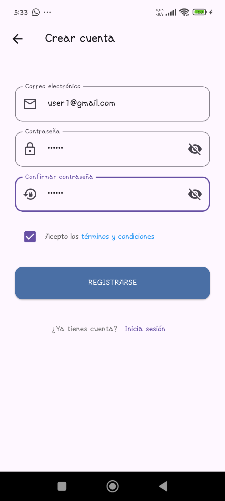
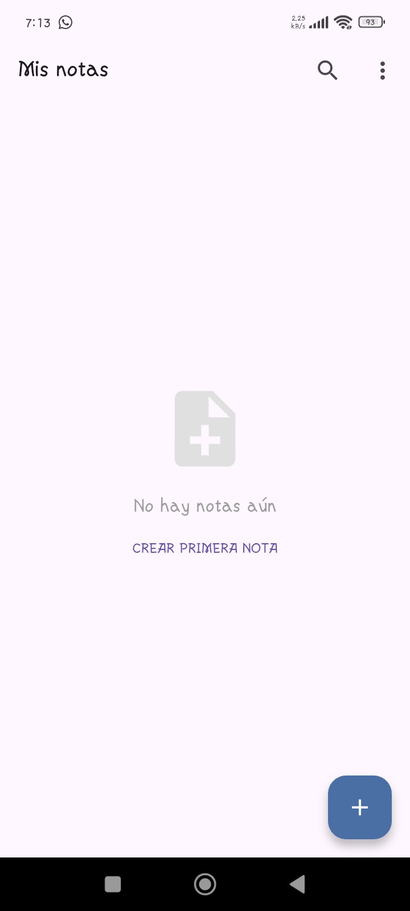

# Notas Discretas - Presentación Feria de Proyectos


## 1. Portada
**Nombre de la Aplicación:** Notas Discretas  
**Lema:** "Tus pensamientos, organizados y seguros"  
**Logo:**  


## 2. Resumen Ejecutivo (150 palabras)
Notas Discretas es una aplicación móvil diseñada para la gestión segura y organizada de notas personales. Desarrollada con Flutter y Firebase, ofrece autenticación robusta, sincronización en la nube y una interfaz intuitiva. 

La aplicación permite crear, editar y categorizar notas con funcionalidades avanzadas como búsqueda inteligente y personalización de temas. Utiliza el patrón BLoC para una arquitectura limpia y escalable, garantizando un rendimiento óptimo tanto en iOS como Android.

Destaca por su enfoque en la privacidad, con autenticación mediante Google Sign-In y almacenamiento cifrado. La solución es ideal para estudiantes, profesionales y cualquier usuario que necesite organizar sus ideas de manera eficiente y discreta.

## 3. Stack Tecnológico

### Core
- **Flutter 3.7.2** - Framework multiplataforma
- **Dart** - Lenguaje principal

### Firebase
- **Authentication** - Gestión de usuarios
- **Firestore** - Base de datos NoSQL
- **Cloud Messaging** - Notificaciones push

### Patrones Arquitectónicos
- **BLoC** - Gestión de estado
- **Repository** - Acceso a datos

### Dependencias Principales
```yaml
flutter_bloc: ^9.1.1
firebase_auth: ^5.5.3 
cloud_firestore: ^5.6.7
google_sign_in: ^6.1.5
```

## 4. Diagrama Arquitectónico

```
┌─────────────────┐    ┌─────────────────┐    ┌─────────────────┐
│   Presentation  │ ←→ │      BLoC       │ ←→ │   Repository    │
│  (UI Widgets)   │    │  (Business      │    │  (Data Access)  │
└─────────────────┘    │   Logic)        │    └─────────────────┘
        ↑              └─────────────────┘            ↑
        │                     ↑                       │
        └─────────────────────┼───────────────────────┘
                              ↓
                   ┌─────────────────────┐
                   │   Firebase Services │
                   │ (Auth, Firestore)   │
                   └─────────────────────┘
```

## 5. Funcionalidades por Módulo

### 🔐 Módulo de Autenticación
- Login con email/contraseña
- Registro de nuevos usuarios
- Recuperación de contraseña
- Autenticación con Google

### 📝 Módulo de Notas
- Creación/edición de notas
- Categorización por temas
- Búsqueda inteligente
- Sincronización en la nube

### 👤 Módulo de Perfil
- Gestión de datos personales
- Cambio de contraseña
- Configuración de avatar

### ⚙️ Módulo de Configuración
- Selección de tema (claro/oscuro)
- Configuración de notificaciones
- Exportación de datos

## 6. Características Innovadoras

1. **Sincronización en Tiempo Real**: Cambios inmediatos en todos los dispositivos
2. **Búsqueda Inteligente**: Filtrado por contenido, categoría y fecha
3. **Seguridad Mejorada**: Autenticación de dos factores
4. **Personalización**: Temas y avatares personalizables
5. **Offline First**: Funcionalidad sin conexión

## 7. Capturas de Pantalla

  
*Pantalla principal con listado de notas*

  
*Editor de notas con formato avanzado*